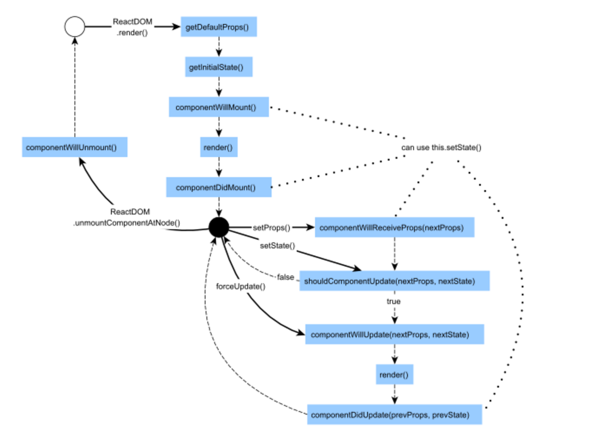

# **LifeCycle**

---

## **Component LifeCycle**  

React Component，就像人會有生老病死一樣有生命週期。一般而言 Component 有以下三種生命週期的狀態：

### 1.**<font color='red'>Mounting</font>**：已插入真實的 DOM  

### 2.**<font color='red'>Updating</font>**：正在被重新render  

### 3.**<font color='red'>Unmounting</font>**：已移出真實的 DOM  

針對 Component 的生命週期狀態 React 也有提供對應的Hook方法：

1.Mounting
<ul>
<li> componentWillMount()</li>
<li> componentDidMount()</li>  
</ul>
2.Updating
<ul>
<li> componentWillReceiveProps(nextProps) </li>
<li> shouldComponentUpdate(nextProps, nextState) </li>
<li> componentWillUpdate(nextProps, nextState) </li>
<li> componentDidUpdate(prevProps, prevState)  </li>
</ul>
3.Unmounting
<ul>
<li> componentWillUnmount()</li>
</ul>

  

Component 生命週期展示 (code)：

```js
class MyComponent extends React.Component {
  constructor(props) {
    super(props);
    console.log('constructor');
    this.handleClick = this.handleClick.bind(this);
    this.state = {
      name: 'Mark',
    }
  }
  handleClick() {
    this.setState({'name': 'thomas'});
  } 
  componentWillMount() {
    console.log('componentWillMount');
  }
  componentDidMount() {
    console.log('componentDidMount');    
  }
  componentWillReceiveProps() {
    console.log('componentWillReceiveProps');        
  }  
  shouldComponentUpdate() {
    console.log('componentShouldUpdate'); 
    return true
  }
  componentWillUpdate() {
    console.log('componentWillUpdate');        
  }
  componentDidUpdate() {
    console.log('componentDidUpdate');        
  }  
  componentWillUnmount() {
    console.log('componentWillUnmount');        
  }    

  render() {
    return (
      <div onClick={this.handleClick}>Hi, {this.state.name}</div>
    )
  }
}

ReactDOM.render(<MyComponent />, document.getElementById('app'));  
```

React Component 規格  

React 特性有描述 React 的主要撰寫方式有兩種：

### 1.一種是使用 ES6 Class  
  
### 2.另外一種是 Stateless Components，使用 Functional Component 的寫法，單純渲染 UI。

---

1.使用 ES6 的 Class（可以進行比較複雜的操作和元件生命週期的控制，相對於 stateless components 耗費資源  

```js
class MyComponent extends React.Component {
    // render 是 Class based 元件唯一必須的方法（method）
    render() {
        return (
            <div>Hello, {this.props.name}</div>
        );
    }
}

MyComponent.propTypes = {
    name: React.PropTypes.string,
}

MyComponent.defaultProps = {
    name: '',
}

ReactDOM.render(<MyComponent name="Mark"/>, document.getElmentById('app'));
```

2.使用 Functional Component 寫法（單純地 render UI 的 stateless components，沒有內部狀態、沒有實作物件和 ref，沒有生命週期函數。若非需要控制生命週期的話建議多使用 stateless components 獲得比較好的效能)  

```js
// 使用 arrow function 來設計 Functional Component 讓 UI 設計更單純（f(D) => UI），減少副作用（side effect）
const MyComponent = (props) => (
    <div>Hello, {props.name}</div>
);

MyComponent.propTypes = {
    name: React.PropTypes.string,
}

MyComponent.defaultProps = {
    name: '',
}

ReactDOM.render(<MyComponent name="Mark"/>, document.getElmentById('app'));
```